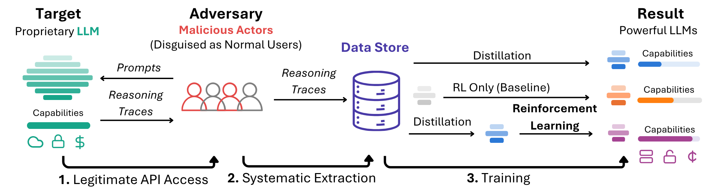
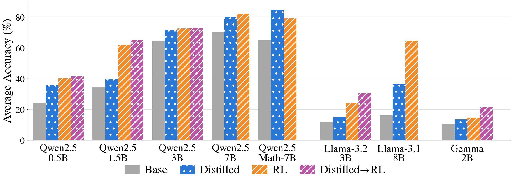
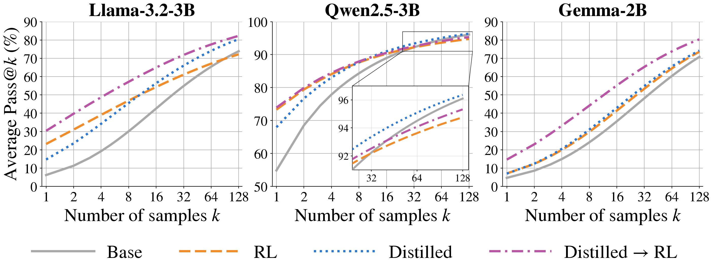
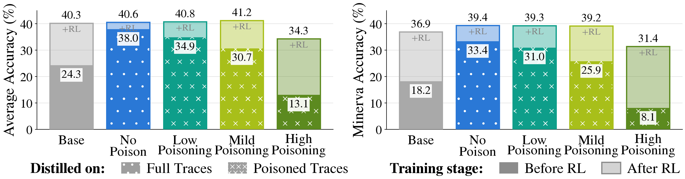
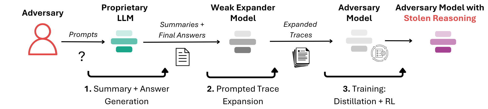
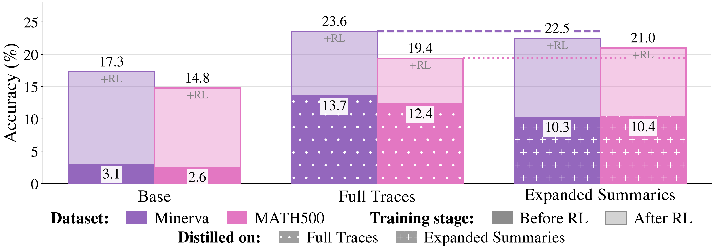
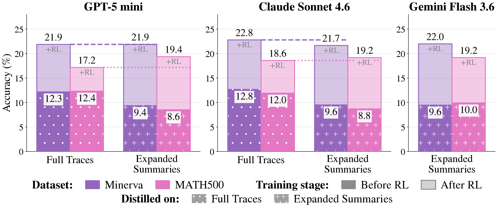

# Distillation Defenses Easily Break After Reinforcement Learning
_Codename Treason: Reinforcement learning makes simple distillation attacks effective at s**T**ealing **Reason**ing_

[See Paper](https://arxiv.org/abs/2609.35699)

**TL;DR** - Realistic threat models for distillation attacks include reinforcement learning after distillation, which makes very simple attacks effective.




**Figure 1** *- **A distillation attack's pipeline**. Attackers amass large volumes of reasoning traces from proprietary LLMs and train ("distill") their own models on these traces, followed by further training of distilled models with reinforcement learning (RL). Existing threat models assume attackers train models only with distillation, while a realistic distillation attack likely follows distillation with RL.*


## Summary

- Reinforcement learning outperforms distillation at improving the reasoning capabilities of a model, and combining distillation and reinforcement learning outperforms either method alone. Distillation attacks by the most capable attackers thus likely combine distillation and reinforcement learning. 
- Evaluating distillation defenses only after distillation creates a false sense of security
- Reinforcement learning makes simple distillation attacks effective. Simple attacks can steal reasoning capabilities from existing closed-source language models using data easily obtainable from current APIs, yielding reasoning improvements equivalent to more sophisticated attacks that extract the full hidden traces. 
- Any distillation defense that leaks sufficient information to reconstruct approximate reasoning traces is likely ineffective.


## Table of Contents
- [Key Results](#key-results)
  - [Threat Models for Realistic Distillation Attacks Must Include Reinforcement Learning](#threat-models-for-realistic-distillation-attacks-must-include-reinforcement-learning)
  - [RL-Free Evaluations Can Give a False Sense of Security](#rl-free-evaluations-can-give-a-false-sense-of-security)
  - [RL Makes Simple Distillation Attacks Effective](#rl-makes-simple-distillation-attacks-effective)
  - [Potential Defenses](#potential-defenses)
- [Replicating Experiments](#replicating-experiments)
  - [Obtaining Full Traces From an Open-Source Teacher](#obtaining-full-traces-from-an-open-source-teacher)
  - [Distillation](#distillation)
  - [Reinforcement Learning](#reinforcement-learning)
  - [Evaluation](#evaluation)
  - [Pass@k Evaluations](#passk-evaluations)
  - [Obtaining Open Source Summaries](#obtaining-open-source-summaries)
  - [Obtaining Summaries from Closed-Source Models](#obtaining-summaries-from-closed-source-models)
  - [Reasoning Trace Expansion](#reasoning-trace-expansion)
- [Bibliography](#bibliography)


## Key Results

[_Skip to running experiments_](#running-experiments)


### Threat Models for Realistic Distillation Attacks Must Include Reinforcement Learning




**Figure 2** *- **RL outperforms distillation, with distillation followed by RL outperforming both**. An attacker aiming to train a state-of-the-art model would likely use distillation to bootstrap subsequent RL, rather than relying solely on distillation. Accuracies are averages over the GSM8K (Cobbe et al., [2021](https://arxiv.org/abs/2110.14168)), Minerva Math (Hendrycks et al., [2021](https://arxiv.org/abs/2103.03874)), and MATH500 (Lightman et al., [2024](https://proceedings.iclr.cc/paper_files/paper/2024/file/aca97732e30bcf1303bc22ac3924fd16-Paper-Conference.pdf)) datasets.*



**Figure 3** *- **Distillation improves pass@k for high k, allowing futher RL to lead to accuracy improvements (pass@1)**. In this sense, distillation bootstraps subsequent RL training. Pass@k is averaged over the GSM8K, Minerva, and MATH500 datasets.*

### RL-Free Evaluations Can Give a False Sense of Security



**Figure 4** *- **Antidistillation sampling can be effective following distillation but break following RL**. Antidistillation sampling (Savani et al., [2025](https://openreview.net/forum?id=Vo2UHqMu8t)) modifies teacher traces to "poison" distilled students, degrading their performance after distillation. A Qwen2.5-0.5B (Qwen Team, [2025](https://arxiv.org/abs/2412.15115)) student is distilled normally and with low, mild, or high poisoning levels; after RL, low- to mildly poisoned student models close the performance gap with the unpoisoned model. An attacker using RL would benefit similarly from antidistillation-sampled data as from regular data. Left: the average accuracy over the GSM8K, MATH500, and Minerva datasets. Right: the performance over Minerva, which is harder than GSM8K and similar in difficulty to MATH500.*

### RL Makes Simple Distillation Attacks Effective

Proprietary LLM APIs return only a summarized version of a model's reasoning to the user (Anthropic, [2026](https://anthropic.com/aug-2026-risk-report); OpenAI Developers, [2026](https://developers.openai.com/api/docs/guides/reasoning#reasoning-summaries)), while the model's final answer is returned as-is. A simple attack to reconstruct full reasoning traces is depicted below. 



**Figure 5** *- **A simple attack to approximately reconstruct closed-source models' reasoning traces**. Note that the reconstructed traces need not be faithful to the hidden, typically unknown, full reasoning traces, but only similarly useful for bootstrapping a model's reasoning.*




**Figure 6** *- **Summaries leak sufficient information to distill reasoning capabilities equal to those achieved using full traces**. After reinforcement learning, the model distilled on expanded summaries (right) performs similarly to the model distilled on full, unobfuscated reasoning traces (middle). Distilling on either full traces or expanded summaries decently outperforms no distillation (left). Open-source setting, with Qwen2.5-14B-RL as the attacked teacher, and Llama-3.2-3B (Grattafiori et al., [2024](https://arxiv.org/abs/2407.21783)) base as the attacker's model.*

#### Stealing Closed-Source Reasoning



**Figure 7** *- **Summaries leak sufficient information to distill reasoning capabilities from closed-source models**. Full traces were obtained with the extraction attack of Panfilov et al. ([2026](https://arxiv.org/abs/2608.09867)), excluding Gemini models, which had the extraction attack patched at the time of writing. After reinforcement learning, a base model (Llama-3.2-3B) distilled on expanded summaries performs similarly to the same model distilled on full traces. Expanded summaries are constructed using information readily available through the model APIs.*

### Potential Defenses

- Results imply that any distillation defense that leaks sufficient information to reconstruct reasoning traces will likely be ineffective. 
- Reasoning traces are harder to reconstruct by omitting information from generated answers, but omissions would damage user experience due to dual-use
  - For example, a researcher can ask a model to generate a proof as part of their research or an attacker can ask the same to improve their own model's capabilities. Removing steps of the proof would harm both the researcher and the attacker alike. 
- Developing more effective real-time batch-level defenses is an important avenue of future work; not just as a more effective defense against distillation attacks, but for defenses against a broad class of vulnerabilities (see also Davies et al., [2026](https://arxiv.org/abs/2602.15001))

## Running Experiments

All experiments use uv to manage virtual environments, which can be installed with the following command

```bash 
curl -LsSf https://astral.sh/uv/install.sh | sh
```

All experiments require the `$SCRATCHDIR` environment variable to be set to the storage location on the HPC dedicated to job outputs. In particular: 
- Distilled models are saved to `$SCRATCHDIR/models`
- RL checkpoints are saved to `$SCRATCHDIR/checkpoints`

Scripts to run experiments are provided in the following section. Key notes:
- At the top of each script are environment variables that should be set / edited.
- Scripts were written for an HPC with arm64 architecture, and required compiling many libraries from scratch. Virtual environment setup may need to be modified for different architectures, but library versions should ideally be kept the same.

### Obtaining Full Traces From an Open-Source Teacher

The following script can be used to obtain full reasoning traces from an open source teacher model. The main function in `reason.py` can be edited to change the dataset or prompt used to generate the traces. 

```bash 
# ./treason/scripts/reason.sh <model_name> <output_path>
./treason/scripts/reason.sh Qwen/Qwen2.5-0.5B treason/datasets/medium-1.5B
```

### Distillation

The script `treason/scripts/distill.sh` is used for distillation. By default, distillation is done on the Llama-3.2-3B base model, which can be edited in the script. 

The following command is an example of how to distill the Llama-3.2-3B base model a dataset. Recall that models are saved to `$SCRATCHDIR/models`, and datasets are stored in the `treason/datasets` directory.

```bash
./treason/scripts/distill.sh --dataset dataset_name --output_name Llama-3.2-3B-distill
```

### Reinforcement Learning

The RL framework we use is taken from SimpleRL-Zoo (Zeng et al., [2025](https://arxiv.org/abs/2503.18892)), and slighly modified to work our our arm-64 based HPC cluster. 

The following command is an example of how to do RL on the Llama-3.2-3B base model. The script can be modified or replicated for other base models stored on huggingface. 

```bash
./simpleRL/train_llama3B_rl.sh
```

The following command is an example of how to do RL on a distilled model that has been saved to `$SCRATCHDIR/models`

```bash
./simpleRL/train_local_rl.sh --model_name model_name
```

Checkpoints are saved to `$SCRATCHDIR/checkpoints`. Before evaluation of any checkpoint, the model should be moved to `$SCRATCHDIR/models` 

#### Important ⚠️

- RL scipts are sensitive to library versions, which should not be changed
- A known bug exists when using flash-attention backend with the simpleRL framework. It is set to use an xformers backend - this should not be changed.  

### Evaluation

6 datasets are available for evaluation, based on the the LM-Eval Harness framework (Gao et al., [2024](https://zenodo.org/records/12608602)). The `simple` suffix in dataset names triggers the use of a custom simple prompt reserved for smaller models, following the approach used by Zeng et al., [2025](https://arxiv.org/abs/2503.18892). The datasets with no suffix, or with the `complex` suffix, evaluate models with the complex prompt from the same work.

- `minerva_math` or `minerva_math_simple`
- `minerva_math500` or `minerva_math500_simple`
- `gsm8k-complex` or `gsm8k-simple`

The following command is an example of how to evaluate a remote model on huggingface, like Llama3.2-3B.

```bash
#eval_remote.sh <model_name> <eval_dataset>
./treason/scripts/eval_remote.sh meta-llama/Llama-3.2-3B gsm8k-simple
```
The following command is an example of how to evaluate a model that has been saved to `$SCRATCHDIR/models`

```bash
#eval_local.sh <model_name> <eval_dataset>
./treason/scripts/eval_local.sh Llama-3.2-3B-distill-claude-expand-RL gsm8k-simple
```

### Pass@k Evaluations 

The following command is an example of how to perform pass@k evaluations of any model, whether on hugging face or stored locally on `$SCRATCHDIR/models`. Pass@k evaluations are supported on the MATH500 (`math_500`), GSM8K (`gms8k`)and Minerva (`minerva`) datasets.

```bash
# ./treason/scripts/pass_at_k.sh <path_to_model> <output_name> <dataset_name>
./treason/scripts/pass_at_k.sh meta-llama/Llama-3.2-3B Llama-3.2-3B-math_500 math_500
```

### Obtaining Open-Source Summaries 

Any full traces can be summarized with the following command:

```bash 
./treason/scripts/summarize.sh --model_name Qwen/Qwen2.5-7B-Instruct --dataset_path treason/datasets/open-source-traces --output_path treason/datasets/open-source-summary
```

### Obtaining Summaries from Closed-Source Models
API queries used to obtain summaries and final answers from closed source models are shown below.

#### Claude-Sonnet-4.6

```python
client.messages.create(
    model="claude-sonnet-4-6",
    max_tokens=12000,
    system="You are a helpful assistant.",
    thinking={"type": "enabled", "budget_tokens": 8192, "display": "summarized"},
    messages=[
        {
            "role": "user",
            "content": f"{question}\nPlease reason step by step, and put your final answer within \\boxed{{}}.",
        }
    ],
)
```

#### Gemini Flash 3.6

```python
client.models.generate_content(
    model="gemini-3.6-flash",
    contents=f"{question}\nPlease reason step by step, and put your final answer within \\boxed{{}}.",
    config=types.GenerateContentConfig(
        system_instruction="You are a helpful assistant.",
        thinking_config=types.ThinkingConfig(
            include_thoughts=True,
            thinking_level="high",
        ),
    ),
)
```

#### GPT-5 mini

GPT5 mini summaries and answers were obtained by querying the API with the following command:

```python
client.responses.create(
    model="gpt-5-mini",
    instructions="You are a helpful assistant.",
    input=f"{question}\nPlease reason step by step, and put your final answer within \\boxed{{}}.",
    reasoning={"summary": "auto", "effort": "high"},
)
```

### Reasoning Trace Expansion

The following examples show how summaries in the datasets above can be expanded. All expanded datasets are also saved to `treason/datasets`.

```bash
# open-source summary expansion
./treason/scripts/expand_opensource.sh --dataset_path treason/datasets/open-source-summary --output_path treason/datasets/open-source-expand

# closed-source model stage 1 expansion
./treason/scripts/expand_stage_1.sh --dataset_path treason/datasets/claude-summary --output_path treason/datasets/claude-stage-1

# closed-source model stage 2 expansion
./treason/scripts/expand_stage_2.sh --dataset_path treason/datasets/claude-stage-1 --output_path treason/datasets/claude-stage-2
```

## Citation
```
@misc{javaheri2026distillationdefenseseasilybreak,
      title={Distillation Defenses Easily Break After Reinforcement Learning}, 
      author={Shidan Javaheri and Alexander Panfilov and Oliver Britton and Yarin Gal and Yonatan Gideoni},
      year={2026},
      eprint={2609.35699},
      archivePrefix={arXiv},
      primaryClass={cs.LG},
      url={https://arxiv.org/abs/2609.35699}, 
}
```

## Bibliography

Anthropic. "Risk Report: August 2026." *Anthropic* (2026). Published under version 3.4 of the Responsible Scaling Policy.

Cobbe, Karl, et al. "Training Verifiers to Solve Math Word Problems." *arXiv preprint arXiv:2110.14168* (2021).

Davies, Xander, et al. "Boundary Point Jailbreaking of Black-Box LLMs." *arXiv preprint arXiv:2602.15001* (2026).

Gao, Leo, et al. "The Language Model Evaluation Harness." *Zenodo* (2024).

Grattafiori, Aaron, et al. "The Llama 3 Herd of Models." *arXiv preprint arXiv:2407.21783* (2024).

Hendrycks, Dan, et al. "Measuring Mathematical Problem Solving With the MATH Dataset." *Advances in Neural Information Processing Systems* (2021).

Lightman, Hunter, et al. "Let's Verify Step by Step." *International Conference on Learning Representations* (2024).

OpenAI Developers. "Reasoning models: Reasoning summaries." *OpenAI Developers* (2026). Accessed: 2026-08-30.

Panfilov, Alexander, et al. "Stealing Reasoning Traces from Proprietary LLM APIs." *arXiv preprint arXiv:2608.09867* (2026).

Qwen Team. "Qwen2.5 Technical Report." *arXiv preprint arXiv:2412.15115* (2025).

Savani, Yash, et al. "Antidistillation Sampling." *The Thirty-ninth Annual Conference on Neural Information Processing Systems* (2025).

Zeng, Weihao, et al. "SimpleRL-Zoo: Investigating and Taming Zero Reinforcement Learning for Open Base Models in the Wild." *arXiv preprint arXiv:2503.18892* (2025).
